!!! info "🟢 Статус: Conceptually stable · v0.1"
    Концепция устойчива, проверена опытом, литературой и практикой.


# 05. Многоуровневая модель: шаблоны, теги и смысл событий

В предыдущих главах разобраны четыре важных понятия: **сервисная модель** (глава 1), **severity-как-действие** (глава 2), **двухосная структура host groups + tags** (глава 3) и **LLD/prototypes** (глава 4). По отдельности каждое из них работает.

Но при первой же попытке спроектировать реальный шаблон возникает вопрос: **а как они складываются вместе?** В каком шаблоне жить какой метрике? Какой тег вешать на хост, какой — на trigger? Что окажется в событии в момент срабатывания? Куда пойдёт алерт?

Без явного ответа на эти вопросы дизайн расползается: в одном шаблоне OS-метрики смешаны с прикладными, теги ставятся хаотично, а через полгода два инженера ставят разные `service=` на одинаковые хосты.

Эта глава — про **единый дизайнерский язык**, на котором собирается всё остальное.

---

## 1. Почему «слой» — не одно понятие

Слово «слой» в обсуждениях мониторинга используется в **четырёх разных смыслах**, и без разведения их книга превращается в кашу:

| # | Тип слоя | Что описывает | Где обсуждается |
|---|---|---|---|
| 1 | **Monitoring layers** | *Что* измеряем (Hardware → Business) | глава 6 (Архитектура) |
| 2 | **Template composition layers** | *Как* собираем шаблоны (Base / Role / App / Synthetic) | эта глава, глава 13 |
| 3 | **Tag placement layers** | *Где* живёт тег (Host / Template / Item / Trigger / Service) | глава 3, эта глава |
| 4 | **Event / routing layers** | *Что* приходит в событие и *куда* оно идёт | эта глава |

Эти четыре измерения **ортогональны**: одна и та же метрика существует во всех четырёх одновременно. Например, free space на диске:

- Monitoring layer: **OS**
- Template composition layer: реализуется через `Plant: Windows Base` (linked template)
- Tag placement: тег `component=filesystem` — на item prototype, тег `service=1c-erp` — на host
- Event/routing: при срабатывании событие получает оба тега и маршрутизируется в команду `it-apps` потому что `service=1c-erp`

Четыре измерения, одна метрика. Дизайн — это согласование всех четырёх.

---

## Диаграммы к главе

В этой главе полезно держать перед глазами две разные схемы:

1. **Операционная модель мониторинга** — показывает не только Zabbix, а весь контур: что мониторим, как собираем, как обрабатываем, куда алертим, как реагируем и как потом измеряем качество.
2. **Поток данных целевой архитектуры** — показывает технический путь метрик и событий: источники → proxy → server/БД → обработка → каналы → Service Desk/runbooks → incident lifecycle → postmortem.

<iframe
  src="../diagrams/monitoring_arch_layers.html"
  title="Архитектура мониторинга как операционная модель"
  loading="lazy"
  style="width: 100%; height: 800px; border: 1px solid var(--md-default-fg-color--lightest); border-radius: 6px;"
  sandbox="allow-scripts allow-same-origin"
></iframe>

<iframe
  src="../diagrams/monitoring_flow.html"
  title="Целевая архитектура мониторинга: поток данных"
  loading="lazy"
  style="width: 100%; height: 620px; border: 1px solid var(--md-default-fg-color--lightest); border-radius: 6px; margin-top: 1rem;"
  sandbox="allow-scripts allow-same-origin"
></iframe>

---

## 2. Четыре измерения слоёв

### 2.1 Monitoring layers — что измеряем

Подробно эти слои описаны в [главе 1](01_service_not_host.md) и [главе 6](06_architecture.md). Кратко:

```text
Business     ← "1С позволяет провести документ?"  (synthetic)
Application  ← "rphost жив, очереди в норме"        (app metrics)
Middleware   ← "MSSQL отвечает, deadlock'ов нет"    (DB metrics)
OS           ← "CPU, RAM, диски, сервисы"           (Zabbix agent)
Network      ← "интерфейсы, BGP, тоннели"           (SNMP)
Hardware     ← "iLO, ИБП, температура, RAID"        (IPMI/SNMP)
```

Это **семантика**: что вообще измеряется. Не «как реализовано», не «где в Zabbix живёт». Просто карта смысла.

### 2.2 Template composition layers — как собираем шаблоны

В Zabbix **нет ООП-наследования** в строгом смысле. Есть:

1. **Linked templates** — на хост можно прилинковать несколько шаблонов одновременно
2. **Template links** — шаблоны могут ссылаться на другие шаблоны (template-to-template linking)

Это не parent-child с override-логикой. Это **композиция**: на хост вешается стек шаблонов, каждый отвечает за свою часть.

Правильная картина:

```text
Host: 1c-app-warehouse-01
  ├─ Plant: Common Policy        ← macros, conventions, общие технические теги
  ├─ Plant: Agent Health         ← agent availability, active checks freshness
  ├─ Plant: Windows Base         ← OS-метрики: CPU/RAM/Disk/Net через LLD
  ├─ Plant: Windows Services     ← discovery и проверка важных сервисов
  ├─ Plant: 1C App Server        ← rphost, sessions, locks, прикладные метрики
  ├─ Plant: HASP License Client  ← лицензии HASP — отдельная роль
  └─ Plant: Synthetic 1C Login   ← пользовательский путь: логин test_user
```

Семь шаблонов на одном хосте — норма, а не перегруз. Каждый отвечает за свой узкий слой:

**Четыре класса шаблонов** в этой модели:

| Класс | Назначение | Примеры |
|---|---|---|
| **Base** | ОС, агент, инфраструктурные ресурсы | `Plant: Windows Base`, `Plant: Linux Base`, `Plant: Network SNMP Base`, `Plant: Hypervisor Base` |
| **Role** | Роль хоста в системе | `Plant: Role - 1C App Node`, `Plant: Role - MSSQL Server`, `Plant: Role - Exchange DAG Member` |
| **Application** | Прикладные метрики, дающие смысл сервису | `Plant: 1C App Server`, `Plant: MSSQL for 1C`, `Plant: Exchange DAG` |
| **Synthetic** | Проверка «видит ли пользователь сервис» | `Plant: Synthetic - 1C Web Login`, `Plant: Synthetic - OWA`, `Plant: Synthetic - SMTP Roundtrip` |

Между Role и Application грань тонкая. Эмпирическое правило: **Role описывает конфигурацию хоста**, **Application описывает работу прикладной системы**.

Например: `Plant: Role - MSSQL Server` — это «на хосте установлен MSSQL, мониторим сервис, порт 1433, базовые wait stats». `Plant: MSSQL for 1C` — это «на этой инстанции живёт 1С: deadlocks для базы 1С, размер tempdb, специфика её рабочей нагрузки».

**Зачем такая декомпозиция:**

- ⚡ **Не дублируются OS-метрики.** CPU/RAM/Disk собираются один раз в `Windows Base`. Application templates их не повторяют.
- 🔄 **Изоляция апгрейдов.** Можно обновить `Plant: 1C App Server` без риска сломать OS-метрики.
- 🧪 **Тестовые стенды = production-шаблоны минус один слой.** Тестовый сервер 1С — те же шаблоны, кроме `Synthetic`. Один список линкуемых шаблонов = одна разница.
- 📊 **Организационный ownership по композиции.** В Zabbix права строятся через user roles и host groups, не через шаблоны напрямую. Но шаблонная декомпозиция отражает организационный ownership в Git/review: команда DBA отвечает за `Plant: MSSQL for 1C`, команда 1С — за `Plant: 1C App Server`. Это помогает контролировать изменения через code review, а не через UI-права.

**Антипаттерн:** один монолитный шаблон `Plant: 1C Everything`, в котором лежит и `vfs.fs.size`, и `rphost discovery`. Такой шаблон через полгода непригоден к модификации.

### 2.3 Tag placement layers — где живёт тег

Теги в Zabbix задаются на разных уровнях, и каждый уровень несёт свой смысл:

```text
Zabbix Service   ← "это бизнес-сервис"   (Service tags для SLA/service actions;
   ↑                                       Problem tags для сопоставления Problems с сервисом)
Trigger / Trigger prototype  ← "что именно сломалось и что делать"
   ↑
Item / Item prototype        ← "что измеряется"
   ↑
Template         ← "конвенции этого класса систем"
   ↑
Host             ← "что это за объект и кто за него отвечает"
```

Все теги со всех уровней **наследуются в проблемное событие**. Это значит: в момент срабатывания у события есть **полный набор тегов** со всех слоёв сразу. Это и есть точка, в которой склеиваются объект, проблема и способ реакции.

Подробная матрица — в разделе 4 ниже.

### 2.4 Event / routing layers — что приходит в событие

Это самое важное измерение, которое обычно проскакивают: **дизайн всех остальных слоёв осмыслен только потому, что в итоге собирается осмысленный problem event**.

Поток:

```text
1. Item собирает метрику
2. Trigger срабатывает
3. Создаётся PROBLEM event
4. К событию прилипают теги со всех уровней: host + template + item + trigger
5. Action evaluation: проверяются conditions на тегах события
6. Operations: отправка в канал, тикет в ITSM, эскалация
7. У дежурного на экране — полный контекст: что, где, чьё, что делать
```

И отсюда — простой критерий правильного дизайна:

> **Если посмотреть на problem event и не понять без расследования "что упало, где, какой сервис затронут, что делать" — дизайн сломан.**

Это и есть метрика качества проектирования. Если эвент содержит `1c App Server is down on srv-1cd5-04` и больше ничего — придётся гуглить, в каком цеху эта система, кому звонить, есть ли runbook. Если эвент содержит `service=1c-erp env=prod owner=it-apps location=dc-main component=rphost impact=service-degradation runbook=rb-1c-rphost-down` — дежурный действует за 30 секунд.

---

## 3. Composition, не inheritance

Повторим явно, потому что это распространённая путаница.

В Zabbix модель **композиции**, а не **наследования**:

| ООП-наследование (это **не** Zabbix) | Композиция в Zabbix (это правильно) |
|---|---|
| Один parent, один child | Несколько шаблонов на хост |
| Override методов | Нет override; items с одним key конфликтуют |
| Иерархия глубины N | Плоский список linked templates на хост |
| Полиморфизм | Нет полиморфизма |

**Правильная формулировка:** «на хост линкуется набор шаблонов, каждый отвечает за свою грань». Не «`Plant: 1C App Server` наследует от `Plant: Windows Base`».

Можно линковать шаблон-в-шаблон (template-to-template linking), но **не для имитации наследования**, а для агрегации: «`Plant: Role - 1C App Node` включает `Plant: Windows Services Base` для удобства привязки роли одной строкой». Это утилитарное использование, не архитектурный паттерн.

### Где живут общие userparameters и macros

**Антипаттерн:** один шаблон `Plant: Common`, в который сваливают всё «общее». Через год он становится свалкой.

**Правильно — разделить «common» по ролям:**

- **`Plant: Common Policy`** — только macros, conventions, технические теги класса. Никаких items, минимум зависимостей. **Предупреждение:** если несколько шаблонов определяют одинаковые macros с разными значениями, приоритет определяется порядком линкования и уровнем (host > template). Задокументируйте правила macro precedence и ведите drift-контроль, чтобы не получить неожиданного значения порога.
- **`Plant: Agent Health`** — мониторинг самого Zabbix-агента: доступность, свежесть active checks, версия.
- **`Plant: Zabbix Infrastructure`** — self-monitoring самого Zabbix-сервера (см. [главу 12 — Эксплуатационные процедуры](12_operations.md)). Это отдельный контур, потому что **основной Zabbix не может надёжно мониторить сам себя**.

Каждое из них узкое и не разрастается.

---

## 4. Матрица: какой тег где живёт

Это центральная таблица главы. Она снимает 80% вопросов «куда вешать тег».

| Тег | Где задавать | Пример значения | Почему именно там |
|---|---|---|---|
| `env` | **Host** (или autoregistration) | `env=prod` | Среда — свойство хоста целиком, не отдельных items |
| `location` | **Host** | `location=dc-main` | Физическая/логическая площадка хоста |
| `segment` | **Host** | `segment=it`, `segment=ot-dmz` | Влияет на дашборды, доступы, security-контекст |
| `owner` | **Host** | `owner=it-apps` | Базовая команда-владелец |
| `criticality` | **Host** или **Service** | `criticality=P1` | Критичность хоста/сервиса, не отдельной метрики |
| `service` | **Host** / **Web scenario** / **Service** | `service=1c-erp` | Связывает компоненты в бизнес-сервис |
| `os_family` | **Host** или **OS template** | `os_family=windows` | Техническая классификация |
| `role` | **Host** или **Role template** | `role=1c-app` | Что делает этот хост |
| `component` | **Item / Trigger / Prototype** | `component=filesystem`, `component=rphost` | Что именно сломалось |
| `scope` | **Item / Trigger / Prototype** | `scope=capacity`, `scope=availability` | Тип проблемы |
| `impact` | **Trigger** | `impact=rpo-risk`, `impact=outage` | Смысл проблемы для эксплуатации |
| `notification` | **Trigger** | `notification=active`, `notification=dashboard-only`, `notification=none` | Управляет action routing |
| `runbook` | **Trigger** или URL в description | `runbook=rb-1c-rphost-down` | Привязка к конкретному сценарию реагирования |

### Три простых правила

Из этой таблицы выводятся три правила, которые легко запомнить:

> **Правило 1.** Host tags отвечают на вопрос **«что это за объект и кто за него отвечает»**: env, location, segment, owner, criticality, service, os_family, role.

> **Правило 2.** Item / trigger / prototype tags отвечают на вопрос **«что именно произошло»**: component, scope, impact, notification, runbook.

> **Правило 3.** Разделяйте два уровня: event tag `service=<name>` связывает событие с бизнес-сервисом для routing/dashboards, а Zabbix Service tags используются нативным механизмом Services/SLA.

### Где НЕ ставить `service`

Тег `service` — **тег уровня хоста или Zabbix Service**, не trigger. На trigger его задавать стоит **только как осознанное исключение**, когда событие на этом хосте относится к **другому** сервисному контексту, чем сам хост.

Пример исключения: на сервере 1С работает агент Veeam, проверяющий бэкапы. Сам хост — это `service=1c-erp`. Но trigger «бэкап-задание не выполнилось > RPO» — это уже `service=backup` контекстно. В этом случае на trigger ставится отдельный `service=backup`, а на хост остаётся `service=1c-erp`. Но это редкий случай, требующий осознанного решения.

Обычно же — `service` приходит с хоста или Zabbix Service, а на trigger хватает `component`, `scope`, `impact`.

---

## 5. Event semantics: как событие приобретает смысл

Когда trigger срабатывает, Zabbix создаёт **PROBLEM event**. К нему **наследуются теги со всех слоёв**:

```text
Host tags                      ──┐
Template tags                  ──┤
Item / Item prototype tags     ──┤
Web scenario tags              ──┼──► PROBLEM event tags (все вместе)
Trigger tags                   ──┤
Trigger prototype tags         ──┘
```

То есть в момент срабатывания событие имеет **полный набор тегов**. Это даёт два важных следствия:

**1. Action conditions работают через теги.** Не нужно завязываться на host group, severity или имя триггера. Условие читается как фраза:

```text
IF env=prod
AND service=1c-erp
AND notification=active
AND severity >= High
THEN
   - отправить в Telegram канал "1C on-call"
   - создать ITSM ticket priority P2
   - привязать ссылку из {TRIGGER.URL} (runbook)
```

Это понятно, поддерживаемо, расширяемо. Добавился новый сервис — добавили строку в action.

**2. Разрешение конфликтов тегов.** Zabbix не использует «приоритет»: одинаковые пары `tag:value` со всех уровней склеиваются (дублей не будет). Но одинаковые имена тегов с **разными** значениями (`criticality=P1` на хосте и `criticality=P2` на trigger) остаются как два разных event tag — они оба попадут в событие. Это нужно учитывать при фильтрации в action conditions.

Практически: **задавайте тег на одном уровне**. Один тег — один уровень — одно значение.

---

## 6. Сквозной пример: `1c-app-warehouse-01`

Соберём всё вместе на одном реальном хосте.

```mermaid
flowchart LR
    H["Host\n1c-app-warehouse-01"]

    subgraph TG["Host tags"]
      T1["env=prod"]
      T2["service=1c-erp"]
      T3["owner=it-apps"]
      T4["criticality=P1"]
      T5["location=dc-main"]
      T6["segment=it"]
    end

    subgraph TP["Linked templates"]
      B["Plant: Windows Base"]
      A["Plant: 1C App Server"]
      L["Plant: HASP License Client"]
      S["Plant: Synthetic - 1C Web Login"]
    end

    subgraph IT["Items / prototypes"]
      I1["rphost process discovery\ncomponent=rphost\nscope=availability"]
      I2["HASP free licenses\ncomponent=hasp\nscope=capacity"]
      I3["Synthetic login check\ncomponent=synthetic\nscope=availability"]
    end

    subgraph TR["Trigger tags"]
      R1["impact=outage"]
      R2["notification=active"]
      R3["runbook=rb-1c-synthetic-down"]
    end

    E["PROBLEM event\nall inherited tags"]
    AC["Action routing\nTelegram + ITSM"]
    DR["Dashboards / SLA / reports\nreuse the same tags"]

    H --> TG
    H --> TP
    TP --> IT
    IT --> TR
    TG --> E
    TR --> E
    E --> AC
    E --> DR
```



### Контекст

```text
Хост:       1c-app-warehouse-01
Назначение: сервер приложения 1С: УПП (склад)
Среда:      production
Площадка:   DC-Main
Сегмент:    IT (не OT)
ОС:         Windows Server 2019
Команда:    IT Applications
Критичность: P1 (склад зависит от 1С — даун = операционные потери)
```

### Шаг 1. Host groups (для RBAC и грубой навигации)

```text
Applications/1C
Infra/Windows
Locations/DC-Main
```

Три группы — это **достаточный набор для RBAC и навигации в данном примере**. Число групп определяется потребностями RBAC и структурой команды, не фиксированным числом. Группа `Applications/1C` даёт права команде 1С на этот хост. `Infra/Windows` — техническая навигация для системных инженеров. `Locations/DC-Main` — для разделения по площадкам.

### Шаг 2. Host tags

```text
env=prod
service=1c-erp
owner=it-apps
criticality=P1
location=dc-main
segment=it
os_family=windows
role=1c-app
```

Эти 8 тегов — **минимально достаточный набор**, который попадёт в любое событие с этого хоста.

### Шаг 3. Linked templates

```text
1. Plant: Common Policy
2. Plant: Agent Health
3. Plant: Windows Base
4. Plant: Windows Services
5. Plant: 1C App Server
6. Plant: HASP License Client
7. Plant: Synthetic - 1C Web Login
```

Семь шаблонов. Каждый узкий, каждый отвечает за свою грань.

### Шаг 4. Item / prototype tags

В шаблонах на items и prototype'ах висят **технические теги** — что именно измеряется:

```text
# В Plant: Windows Base, на prototype'ах LLD дисков
component=filesystem
scope=capacity
fs={#FSNAME}

# В Plant: 1C App Server, на prototype'ах rphost
component=rphost
scope=availability
process={#PROCESS}

# В Plant: HASP License Client
component=hasp
scope=capacity
license_pool=1c
```

Эти теги не дублируют host tags — они дополняют их **техническим описанием метрики**.

### Шаг 5. Trigger tags

Триггеры добавляют операционное измерение — **что делать, если сработало**:

```text
# Триггер "Один из rphost упал"
scope=availability
component=rphost
impact=service-degradation
notification=active
runbook=rb-1c-rphost-down

# Триггер "HASP < 2 свободных лицензии"
scope=capacity
component=hasp
impact=service-degradation
notification=active
runbook=rb-1c-hasp-exhausted

# Триггер "Synthetic login failed 3 times"
scope=availability
component=synthetic
impact=outage
notification=active
runbook=rb-1c-synthetic-down
```

### Шаг 6. Resulting problem event

Когда trigger «Synthetic login failed 3 times» сработает, в Zabbix создастся PROBLEM event со **всеми тегами одновременно**:

```text
env=prod                            ← с хоста
service=1c-erp                      ← с хоста
owner=it-apps                       ← с хоста
criticality=P1                      ← с хоста
location=dc-main                    ← с хоста
segment=it                          ← с хоста
os_family=windows                   ← с хоста
role=1c-app                         ← с хоста
component=synthetic                 ← с триггера
scope=availability                  ← с триггера
impact=outage                       ← с триггера
notification=active                 ← с триггера
runbook=rb-1c-synthetic-down        ← с триггера
```

Это и есть **смысл события**: всё, что нужно для действия — в одном месте.

### Шаг 7. Action routing

Action в Zabbix настраивается на тегах:

```text
Action: "1C on-call notification"

Conditions:
   - tag service equals "1c-erp"
   - tag env equals "prod"
   - tag notification equals "active"
   - severity >= High

Operations:
   - Send to media: Telegram channel "1C on-call"
   - Create ticket: ITSM priority based on impact tag
   - Include {TRIGGER.URL} (подставляется как URL runbook)

Recovery operations:
   - Notify "RESOLVED" to same channel
```

Дежурный получает **одно сообщение** с полным контекстом и ссылкой на runbook. От события до действия — 30 секунд.

---

## 7. Где переиспользуется эта модель

Самое важное в многоуровневой модели — **она не для красоты шаблонов**. Она для того, чтобы **все остальные подсистемы Zabbix говорили на одном языке**.

| Подсистема | Какие теги использует | Пример |
|---|---|---|
| **Action routing** | host tags + trigger tags | `IF service=1c-erp AND notification=active THEN Telegram` |
| **Дашборды (Grafana / Zabbix Dashboards)** | host/event tags (`service`, `env`, `owner`, `component`) | `WHERE service IN ('1c-erp','mssql-1c','exchange-mailbox')` |
| **Service tree / Business view** | Zabbix Services + problem tags | дерево бизнес-сервисов с их статусами |
| **SLA calculation** | Zabbix Service tags + SLA policy | расчёт `service-availability` за период |
| **Отчёты для CIO** | service + criticality + owner | «доступность по сервисам, по командам, по площадкам» |
| **Capacity reports** | scope=capacity, component=* | «топ-10 ресурсов по росту утилизации за квартал» |
| **Maintenance windows** | host groups + maintenance problem tags | «freeze всех хостов сервиса 1C-ERP с подавлением problems по `service=1c-erp`/`scope=...`» |
| **RBAC** | host groups | права в Zabbix UI |

**Ключевое правило:**

> Дашборды, маршрутизация алертов, SLA-отчёты и сервисное представление **не должны изобретать отдельную структуру**. Они переиспользуют те же теги и слои, которые задаёт дизайн шаблонов.

Если дизайнер дашборда говорит «давайте добавим новое поле X на хост, чтобы фильтровать дашборды» — это сигнал, что **в дизайне тегов есть дыра**. Дашборд не должен требовать своих метаданных; он должен **читать** метаданные, которые уже есть.

В результате получается единая методика, а не набор разрозненных шаблонов: один язык тегов и слоёв переиспользуется в шаблонах, дашбордах, маршрутизации, SLA и отчётах.
---

## 8. Правило «один слой — одна ответственность»

Это короткое правило, которое дисциплинирует дизайн:

| Слой | За что отвечает | За что **не** отвечает |
|---|---|---|
| OS Base template | Здоровье ОС, базовые ресурсы | Прикладные метрики |
| Role template | Конфигурация роли хоста | Бизнес-смысл |
| Application template | Прикладные метрики системы | OS-метрики |
| Synthetic template | Пользовательский путь | Компонентные метрики |
| Host tags | «Кто и чей» (контекст хоста) | «Что сломалось» |
| Item/Trigger tags | «Что произошло» | «Кто отвечает» |
| Trigger description / URL | Что делать (runbook) | Что измерять |

Если при дизайне возникает вопрос «куда поместить эту метрику / этот тег» — посмотрите в таблицу выше. Принцип однозначен.

---

## 9. Антипаттерны

Сводка ошибок именно в этом дизайнерском слое. Общие антипаттерны мониторинга — в [главе 15](15_antipatterns.md).

❌ **Один монолитный шаблон `Plant: 1C Everything`.** Через полгода непригоден к модификации. Делите на Base / Role / Application / Synthetic.

❌ **Вешать `service=`, `env=`, `location=` на item или trigger.** Это host-level теги. Если поставили на item — наследуются в эвент, конфликтуют с host-level, путаются в action.

❌ **Вешать `component=cpu` на host.** Это item/trigger-level тег. Host говорит «что я», а не «что во мне».

❌ **Дублировать OS-метрики в каждом application template.** Один `Windows Base` собирает CPU/RAM/Disk. Application шаблоны их не повторяют.

❌ **Использовать host groups как сервисный каталог.** Группа `Apps/1C/Critical/Warehouse` — это конкатенация тегов в имя. Используйте теги.

❌ **Disaster на каждый технический сбой.** Disaster — только если бизнес-сервис лежит ([глава 2](02_severity_model.md)).

❌ **LLD без `prototype tags`.** Discovered items и triggers не получают технических тегов — события без `component=`/`scope=`, не маршрутизируются.

❌ **Ручное тегирование discovered объектов.** Если discovered интерфейс получает теги вручную — при следующем LLD-cycle они слетят. Теги — на prototype'е.

❌ **Runbook только в Wiki, без ссылки в trigger.** Дежурный в 3 ночи не найдёт. URL обязан быть в `{TRIGGER.URL}` или description.

❌ **`Plant: Common` как бесконтрольный общий шаблон.** Разделите: Policy / Agent Health / Self-monitoring отдельно.

---

## 10. Чек-лист дизайна

Перед линкованием шаблонов к хосту — пройдите по этому списку:

**Host:**

- [ ] Host groups покрывают RBAC и грубую техническую навигацию (3–4 группы максимум)
- [ ] Host tags: `env`, `location`, `segment`, `owner`, `criticality`, `service`, `os_family`, `role` — все 8 заданы
- [ ] Все значения тегов — из tag schema (документ со списком разрешённых значений)

**Templates:**

- [ ] Прилинкован Base-шаблон ОС
- [ ] Прилинкован Role-шаблон (если есть)
- [ ] Прилинкованы Application-шаблоны (по числу прикладных систем)
- [ ] Прилинкован Synthetic-шаблон для критичных сервисов
- [ ] Нет монолитных шаблонов «всё в одном»

**Items / Prototypes:**

- [ ] LLD discovery rules имеют фильтры (не «все интерфейсы», а нужные)
- [ ] Item prototypes имеют теги `component=` и `scope=`
- [ ] Lifecycle policy LLD задана (что делать с исчезнувшими объектами)

**Triggers:**

- [ ] Trigger expression в актуальном Zabbix синтаксисе (`last(/host/key)>X`)
- [ ] Trigger имеет теги `component=`, `scope=`, `impact=`, `notification=`, `runbook=`
- [ ] Trigger dependencies настроены там, где есть понятная причинно-следственная связь (core network → downstream, proxy → агенты) — **не** как "синтетика подавляет всё": синтетика — верхнеуровневый симптом, а не root cause; для сервисной иерархии используйте Zabbix Services + problem tags
- [ ] Каждый Disaster и 80% High имеют URL на runbook

**Events / Actions:**

- [ ] Action conditions написаны на тегах, не на host groups / severity / именах
- [ ] Test-эвент (закрытый вручную) маршрутизируется в правильный канал
- [ ] Recovery notification настроен

**Reuse:**

- [ ] Дашборды читают те же теги, что использует action routing
- [ ] SLA-отчёты считаются через Zabbix Services/SLA policy, а Problems связываются с сервисами по problem tags
- [ ] Maintenance windows имеют host/host group scope и, при необходимости, используют problem tags как фильтр подавления

Если все пункты отмечены — дизайн **скорее всего** консистентен. Полная валидация — только в проде, через пару итераций.

---

## Резюме

Эта глава — **методический центр** книги. Что нужно унести:

1. **Четыре измерения слоёв** ортогональны: monitoring, composition, tag placement, event/routing
2. **Composition, не inheritance.** В Zabbix несколько шаблонов на хост, не parent-child
3. **Четыре класса шаблонов:** Base / Role / Application / Synthetic. Не «всё в одном»
4. **Матрица тегов:** host tags = «что за объект и кто отвечает», item/trigger tags = «что произошло»
5. **Event приобретает смысл** через сумму тегов со всех уровней. Цель дизайна — осмысленный problem event
6. **Многоуровневая модель переиспользуется** в дашбордах, action routing, SLA, отчётах. Не дублируется
7. **Одна метрика — один слой.** Дисциплина дизайна

Эта глава ссылается на [главу 3](03_tags_and_groups.md) (детали по тегам), [главу 4](04_lld_and_prototypes.md) (LLD-prototypes), [главу 13](13_template_requirements.md) (применение к конкретным системам). Если глава 5 — это **дизайн-язык**, то глава 13 — **словарь** этого языка для конкретных систем.
